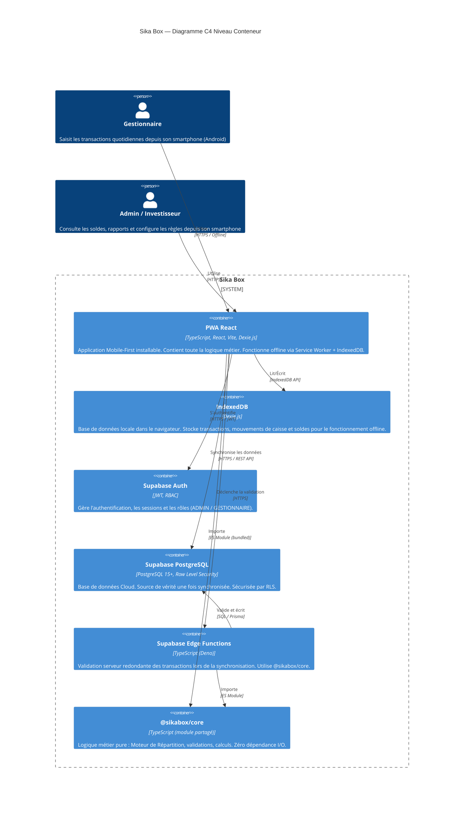
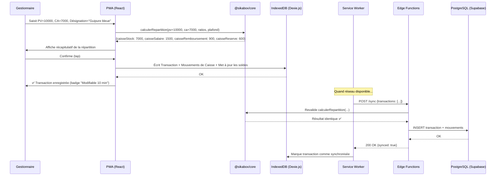
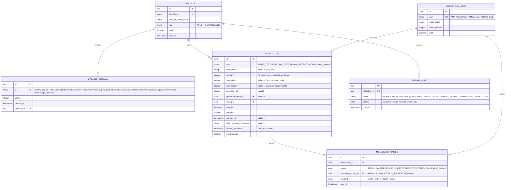

# 01 — ARCHITECTURE TECHNIQUE : SIKA BOX

> **Version** : 1.0  
> **Date** : 06 mars 2026  
> **Auteur** : Lead Architect & Expert Sécurité (IA)  
> **Document de référence** : [00_BIBLE_PROJET.md](00_BIBLE_PROJET.md)  
> **Statut** : Proposition — en attente de validation

---

## Table des matières

1. [Architecture de Haut Niveau](#1-architecture-de-haut-niveau)
2. [Stack Technique Détaillée](#2-stack-technique-détaillée)
3. [Architecture Decision Records (ADR)](#3-architecture-decision-records-adr)
4. [Matrice de Sécurité & RBAC](#4-matrice-de-sécurité--rbac)

---

## 1. Architecture de Haut Niveau

### 1.1 Pattern retenu : Monolithe Modulaire (Client-Heavy, BaaS Backend)

**Le projet ne justifie PAS une architecture Microservices.** Voici pourquoi :

| Critère | Réalité du projet | Conséquence architecturale |
|---------|-------------------|---------------------------|
| Nombre d'utilisateurs simultanés | 2 (un Admin, une Gestionnaire) | Aucun besoin de scaling horizontal |
| Équipe de développement | 1 développeur solo | Un monolithe est maintenable par une personne. Des microservices ne le sont pas. |
| Domaine métier | Un seul Bounded Context (Finance / Répartition) | Pas de raison de découpler en services |
| Contrainte critique | Offline-First | La logique métier DOIT vivre sur le client. Le backend est un point de synchronisation, pas un orchestrateur. |
| Budget infrastructure | Minimal | Un BaaS (Backend-as-a-Service) réduit les coûts opérationnels à quasi-zéro |

**L'architecture retenue est un Client-Heavy PWA avec un BaaS (Supabase) comme backend managé.**

Le gros de la logique métier (Moteur de Répartition, validations, gestion des caisses) s'exécute **côté client** dans le navigateur. Le backend (Supabase) fournit :
- L'authentification (JWT, rôles).
- La persistance (PostgreSQL).
- La sécurité au niveau des données (Row Level Security).
- La validation serveur via Edge Functions (couche de sécurité redondante pour les opérations critiques).

La logique métier est packagée dans un **module TypeScript partagé** (`@sikabox/core`) utilisé à la fois par le frontend et les Edge Functions, ce qui élimine le risque de divergence entre la logique client et la logique serveur.

### 1.2 Diagramme C4 — Niveau Conteneur



### 1.3 Flux de données — Scénario nominal (Vente Textile)



### 1.4 Structure du Monorepo

```
sika-box/
├── packages/
│   ├── core/                    # @sikabox/core — Logique métier pure
│   │   ├── src/
│   │   │   ├── repartition.ts   # Moteur de Répartition
│   │   │   ├── validation.ts    # Règles de validation (PV ≥ CA, etc.)
│   │   │   ├── correction.ts    # Logique de correction (fenêtre 10 min)
│   │   │   ├── types.ts         # Types partagés (Transaction, Caisse, etc.)
│   │   │   └── constants.ts     # Valeurs par défaut (ratios, plafond)
│   │   ├── tests/
│   │   └── package.json
│   │
│   ├── frontend/                # PWA React
│   │   ├── public/
│   │   │   ├── manifest.json    # PWA Manifest
│   │   │   └── icons/
│   │   ├── src/
│   │   │   ├── components/      # Composants UI (formulaires, dashboard)
│   │   │   ├── pages/           # Vues (Dashboard, Vente, MoMo, Admin, etc.)
│   │   │   ├── stores/          # État global (Zustand)
│   │   │   ├── db/              # Schéma Dexie.js + sync engine
│   │   │   ├── hooks/           # Custom hooks React
│   │   │   └── lib/             # Utilitaires, config Supabase
│   │   ├── vite.config.ts
│   │   └── package.json
│   │
│   └── supabase/                # Configuration Supabase
│       ├── migrations/          # Migrations SQL (schéma PostgreSQL)
│       ├── functions/           # Edge Functions (validation sync)
│       ├── seed.sql             # Données initiales (Admin, config)
│       └── config.toml
│
├── docs/                        # Documentation projet
│   ├── 00_BIBLE_PROJET.md
│   └── 01_ARCHITECTURE_TECHNIQUE.md
│
├── turbo.json                   # Configuration Turborepo
├── pnpm-workspace.yaml
├── package.json
└── README.md
```

---

## 2. Stack Technique Détaillée

### 2.1 Frontend

| Composant | Technologie | Version | Justification |
|-----------|-------------|---------|---------------|
| **Framework** | React | 18+ | Écosystème mature, documentation abondante, large communauté. Idéal pour un développeur solo qui trouvera rapidement des réponses. |
| **Build Tool** | Vite | 5+ | Build ultra-rapide, HMR instantané, support natif TypeScript, excellent plugin PWA. |
| **Langage** | TypeScript | 5+ | Typage statique pour la logique financière. Partage des types avec le backend via `@sikabox/core`. Non négociable pour un projet manipulant de l'argent. |
| **PWA** | vite-plugin-pwa | 0.20+ | Wraps Workbox. Génère automatiquement le Service Worker, gère le precaching et les stratégies de cache. |
| **Gestion d'état** | Zustand | 4+ | Léger (~1 KB), API minimaliste, pas de boilerplate. Suffisant pour l'état applicatif (utilisateur connecté, caisse sélectionnée, statut réseau). |
| **Données serveur** | TanStack Query | 5+ | Cache, synchronisation, retry automatique, support offline. Gère les appels Supabase et la logique de sync. |
| **Stockage offline** | Dexie.js | 4+ | Wrapper IndexedDB avec une API Promise/async-await. Supporte les requêtes complexes, les index composites, et les migrations de schéma. |
| **UI Components** | shadcn/ui | — | Composants accessibles (Radix UI) + Tailwind CSS. Non-opinionated : les composants sont copiés dans le projet, pas importés d'un package. Personnalisation totale. |
| **CSS** | Tailwind CSS | 3+ | Utility-first, mobile-first par défaut, purge des classes inutilisées. Cohérent avec l'approche Mobile-First de la Bible. |
| **Icônes** | Lucide React | — | Set d'icônes léger, cohérent, tree-shakeable. |
| **Formulaires** | React Hook Form + Zod | — | Validation performante côté client. Zod est partageable avec `@sikabox/core` pour une validation isomorphe. |

### 2.2 Backend (BaaS)

| Composant | Technologie | Justification |
|-----------|-------------|---------------|
| **BaaS** | Supabase (Cloud ou Self-Hosted) | Fournit Auth + PostgreSQL + REST API + Edge Functions en un seul service. Élimine la nécessité d'écrire et maintenir un serveur API custom. Tier gratuit suffisant pour 2 utilisateurs. Open-source et self-hostable si besoin de souveraineté des données. |
| **Authentification** | Supabase Auth (GoTrue) | JWT, gestion des rôles via custom claims (`role: ADMIN` / `role: GESTIONNAIRE`), refresh tokens. |
| **API** | Auto-generated REST (PostgREST) | API REST auto-générée depuis le schéma PostgreSQL. Sécurisée par Row Level Security. Aucun endpoint custom à écrire pour les opérations CRUD. |
| **Validation serveur** | Supabase Edge Functions (Deno) | TypeScript. Exécutent la validation redondante des transactions synchronisées en important `@sikabox/core`. Couche de sécurité `defense-in-depth`. |
| **Gestionnaire de paquets** | pnpm | Monorepo workspace support natif. Rapide, efficient en espace disque (hardlinks). |

### 2.3 Base de Données

| Composant | Technologie | Justification |
|-----------|-------------|---------------|
| **Type** | SQL Relationnel | Les données financières ont un schéma strict et des relations claires (Transaction → Mouvements de Caisse → Caisse). L'intégrité référentielle et les contraintes ACID sont non négociables pour de l'argent. |
| **SGBD** | PostgreSQL 15+ | Via Supabase. Row Level Security natif pour le RBAC. Types numériques précis (`INTEGER` pour FCFA — pas de flottants). Triggers pour les invariants métier (solde caisse ≥ 0). |
| **Offline (client)** | IndexedDB via Dexie.js | Schéma miroir simplifié de PostgreSQL. Source de vérité locale quand offline. Marquage des données `synced: boolean`. |

#### Schéma relationnel (simplifié)



### 2.4 Infrastructure

| Composant | Technologie | Justification |
|-----------|-------------|---------------|
| **Hébergement Frontend** | Vercel ou Cloudflare Pages | Déploiement automatique depuis GitHub. CDN global (important pour le Bénin — nœuds en Afrique de l'Ouest). HTTPS natif. Tier gratuit suffisant. |
| **Hébergement Backend** | Supabase Cloud (tier gratuit) | Managed PostgreSQL + Auth + Edge Functions. Pas d'infrastructure à gérer. Self-hostable en V2+ si nécessaire. |
| **CI/CD** | GitHub Actions | Intégré à GitHub. Pipeline : lint → tests unitaires (`@sikabox/core`) → build → deploy. Gratuit pour les repos publics, 2000 min/mois pour les privés. |
| **Containerisation** | Docker (développement local uniquement) | Docker Compose pour lancer Supabase en local (PostgreSQL + GoTrue + PostgREST). Pas de Docker en production (le BaaS est managé). |
| **Monorepo** | Turborepo + pnpm workspaces | Orchestration des builds, cache intelligent, scripts partagés. Léger et rapide. |
| **Monitoring** | Sentry (tier gratuit) | Capture des erreurs JavaScript en production. Alerte sur les erreurs de synchronisation. Critique pour un dev solo qui n'est pas devant l'app 24/7. |

---

## 3. Architecture Decision Records (ADR)

### ADR-001 : Monolithe Modulaire (Client-Heavy + BaaS) vs Microservices

| Champ | Contenu |
|-------|---------|
| **Titre** | Choix du pattern Monolithe Modulaire avec BaaS vs Architecture Microservices |
| **Contexte** | Le projet Sika Box est développé par un développeur solo, pour 2 utilisateurs (Admin + Gestionnaire), avec une contrainte forte d'Offline-First. Le KPI « Disponibilité hors-ligne : 100 % » impose que la logique métier critique s'exécute sur le client. Le KPI « Fiabilité de synchronisation : zéro perte de données » impose une couche serveur fiable mais simple. |
| **Options considérées** | 1. **Microservices** (API Gateway + Auth Service + Transaction Service + Sync Service). 2. **Monolithe Backend classique** (Node.js/Express + PostgreSQL). 3. **Client-Heavy + BaaS** (PWA avec logique métier embarquée + Supabase). |
| **Décision** | **Option 3 : Client-Heavy + BaaS (Supabase).** |
| **Conséquences positives** | — La logique métier est centralisée dans `@sikabox/core`, testable indépendamment. — Offline-First natif car le client est autonome. — Le BaaS élimine la maintenance d'un serveur API (Auth, CRUD, hosting). — Coût d'infrastructure quasi-nul (tiers gratuits). — Un seul développeur peut maintenir l'ensemble. |
| **Conséquences négatives (dette acceptée)** | — Logique métier dupliquée (client + Edge Functions). Mitigé par le module partagé `@sikabox/core`. — Dépendance à Supabase. Mitigé par le fait que Supabase est open-source et self-hostable. — Le client est « fat » (bundle plus gros). Mitigé par le code-splitting et le lazy loading. |

### ADR-002 : PostgreSQL vs MongoDB vs Firebase/Firestore

| Champ | Contenu |
|-------|---------|
| **Titre** | Choix de PostgreSQL comme SGBD vs MongoDB vs Firebase Firestore |
| **Contexte** | L'application manipule des données financières (FCFA, calculs de répartition, soldes de caisses). L'intégrité des données est le KPI implicite le plus critique : une erreur d'arrondi ou un mouvement de caisse orphelin peut causer une perte financière réelle. La Bible impose des relations strictes : Transaction → Mouvements de Caisse → Caisse, avec des contraintes d'immutabilité après la Fenêtre de Correction. |
| **Options considérées** | 1. **PostgreSQL** (SQL, ACID, RLS). 2. **MongoDB** (NoSQL document, flexible). 3. **Firebase Firestore** (NoSQL, offline-sync intégré). |
| **Décision** | **PostgreSQL 15+** via Supabase. |
| **Conséquences positives** | — **Intégrité référentielle** : `FOREIGN KEY`, `CHECK`, `NOT NULL` empêchent les données incohérentes au niveau de la BDD. — **ACID** : les transactions SQL garantissent que `Transaction + Mouvements de Caisse` sont atomiques (tout ou rien). — **Row Level Security** : le RBAC est appliqué au niveau SQL, pas juste au niveau de l'API. Même en accédant directement à la BDD, un `GESTIONNAIRE` ne peut pas modifier une `VARIABLE_GLOBALE`. — **`INTEGER` pour FCFA** : pas de risque d'arrondi flottant. `CHECK (montant >= 0)` sur les soldes. — **Triggers** : possibilité d'ajouter des invariants métier en base (ex: trigger qui vérifie que le solde de caisse ne passe jamais en négatif). |
| **Conséquences négatives (dette acceptée)** | — Pas de synchronisation offline native (contrairement à Firestore). Le sync engine doit être développé sur mesure avec Dexie.js + TanStack Query. C'est le principal coût de développement. — Le schéma est rigide. Les évolutions de schéma nécessitent des migrations SQL. Mitigé par les migrations Supabase et le fait que le domaine est stable. |

### ADR-003 : React + Vite vs SvelteKit vs Next.js

| Champ | Contenu |
|-------|---------|
| **Titre** | Choix de React + Vite comme framework frontend vs SvelteKit vs Next.js |
| **Contexte** | L'application est une PWA Mobile-First, Offline-First. Le KPI « Temps de saisie < 15 secondes » exige une UX réactive et fluide. Le développeur est un ingénieur AI/DevOps — pas nécessairement spécialisé frontend. Le choix du framework impacte la productivité, la maintenabilité et la disponibilité des ressources d'apprentissage. |
| **Options considérées** | 1. **React + Vite** (SPA, client-side). 2. **SvelteKit** (compiler-first, léger). 3. **Next.js** (SSR/SSG, React-based). |
| **Décision** | **React 18+ avec Vite.** |
| **Conséquences positives** | — **Écosystème le plus large** : shadcn/ui, Dexie.js, TanStack Query, Zustand — tous React-first. — **Documentation abondante** : un développeur solo bloqué sur un problème trouvera une réponse en minutes, pas en heures. — **SPA pur** : pas de SSR nécessaire (pas de SEO, pas de contenu public). L'app entière est servie comme des fichiers statiques, ce qui simplifie l'hosting et le cache offline. — **vite-plugin-pwa** : intégration PWA/Workbox native avec Vite. — **TypeScript first-class** depuis Vite et React 18. |
| **Conséquences négatives (dette acceptée)** | — Bundle plus gros que Svelte (mitigé par code-splitting/lazy loading). — React n'est pas le framework le plus performant (mais largement suffisant pour 2 utilisateurs). — Pas de SSR (mais non nécessaire — il n'y a pas de contenu à indexer). |
| **Pourquoi pas SvelteKit ?** | Svelte est techniquement excellent (bundles plus petits, réactivité native), mais son écosystème est 5x plus petit. Pour un développeur solo, la taille de l'écosystème et la disponibilité des solutions pré-existantes sont des facteurs de productivité critiques. |
| **Pourquoi pas Next.js ?** | Next.js est optimisé pour le SSR et le rendu serveur, ce qui est en contradiction directe avec le paradigme Offline-First. Une PWA Next.js est possible mais nécessite des contorsions architecturales (désactiver le SSR, gérer le Service Worker manuellement). React + Vite est plus naturel pour une SPA Offline-First. |

### ADR-004 : Sync Engine custom (Dexie.js + TanStack Query) vs PouchDB/CouchDB

| Champ | Contenu |
|-------|---------|
| **Titre** | Choix d'un Sync Engine custom vs PouchDB/CouchDB pour la synchronisation Offline |
| **Contexte** | Le KPI « Fonctionnement offline 100 % » et « Zéro perte de données lors des synchronisations » imposent un mécanisme de sync robuste. Les transactions sont de type « ajout seul » (append-only), ce qui simplifie la résolution de conflits. Les Variables Globales suivent un conflit « dernier écrit gagne ». |
| **Options considérées** | 1. **PouchDB (client) + CouchDB (serveur)** : sync bi-directionnel intégré. 2. **Dexie.js (IndexedDB) + sync custom vers Supabase** : sync maison contrôlée. 3. **PowerSync** : solution tierce de sync PostgreSQL offline. |
| **Décision** | **Dexie.js + Sync Engine custom vers Supabase.** |
| **Conséquences positives** | — **Contrôle total** sur la logique de sync et la résolution de conflits (important pour la Fenêtre de Correction de 10 min). — **PostgreSQL comme source de vérité** (cohérent avec ADR-002). PouchDB/CouchDB imposerait un SGBD NoSQL côté serveur. — **Dexie.js** : API mature, performante, avec support des migrations de schéma IndexedDB. — La logique de sync est simple : les transactions sont append-only, le client pousse les nouvelles transactions non synchronisées et tire les mises à jour de Variables Globales. |
| **Conséquences négatives (dette acceptée)** | — Le sync engine doit être développé et testé manuellement (pas de sync automatique comme PouchDB). estimé à ~2-3 jours de développement. — Les cas limites (correction pendant une sync partielle, perte de réseau en cours de sync) doivent être gérés explicitement. — PowerSync aurait pu résoudre ce problème automatiquement, mais ajoute une dépendance tierce supplémentaire et un coût. |

### ADR-005 : Module TypeScript partagé (`@sikabox/core`) pour la logique métier

| Champ | Contenu |
|-------|---------|
| **Titre** | Extraction de la logique métier dans un module TypeScript partagé |
| **Contexte** | La logique métier (Moteur de Répartition, validations, gestion de la Fenêtre de Correction) doit s'exécuter sur le client (pour l'offline) ET être validée côté serveur (pour la sécurité). Dupliquer ce code est une source garantie de bugs. |
| **Décision** | Créer un package `@sikabox/core` dans le monorepo, contenant **exclusivement** des fonctions pures TypeScript (zéro dépendance I/O, zéro import de framework). Ce module est importé par le frontend (bundled via Vite) et par les Edge Functions Supabase. |
| **Conséquences positives** | — **Single Source of Truth** pour la logique métier. Un bug corrigé dans `core` est corrigé partout. — **Testabilité maximale** : fonctions pures = tests unitaires triviaux (entrée → sortie). — **Portabilité** : si le frontend ou le backend change, la logique métier reste intacte. |
| **Conséquences négatives (dette acceptée)** | — Complexité du monorepo (Turborepo + pnpm workspaces). Mitigé par le fait que la structure est simple (3 packages). — Les Edge Functions Supabase tournent sur Deno, pas Node.js. Le module `@sikabox/core` doit être compatible ESM pur (pas de CommonJS, pas de dépendances Node-only). |

---

## 4. Matrice de Sécurité & RBAC

### 4.1 Principes de sécurité

| Principe | Implémentation |
|----------|----------------|
| **Defense in depth** | RBAC appliqué à 3 niveaux : UI (routes protégées) → API (JWT + custom claims) → BDD (Row Level Security PostgreSQL). |
| **Least privilege** | Chaque rôle n'a accès qu'aux opérations strictement nécessaires. La Gestionnaire ne voit même pas les routes Admin dans le bundle JS (lazy loading conditionnel). |
| **Immutabilité des données financières** | Aucune opération `DELETE` n'existe dans le système. Les transactions sont append-only. Les corrections créent de nouveaux mouvements (écriture inverse + écriture corrigée). |
| **Audit trail** | Toute modification de Variable Globale et toute correction de transaction sont journalisées avec horodatage et auteur. |
| **Appareils séparés** | L'Admin et la Gestionnaire utilisent des appareils différents. Pas de basculement de session. Le token JWT est lié à l'appareil via un refresh token unique. |

### 4.2 Matrice RBAC — Rôles × Ressources × Droits

> **Légende** : C = Create, R = Read, U = Update, D = Delete, — = Aucun droit

| Ressource | ADMIN | GESTIONNAIRE | Notes |
|-----------|-------|--------------|-------|
| **Variables Globales** | | | |
| → Plafond de Capital | R, U | R | Admin seul peut modifier. Gestionnaire voit la valeur (affichée sur le dashboard). |
| → Ratios de Répartition | R, U | R | Idem. |
| → Ratios post-Plafond | R, U | R | Idem. |
| → Solde Initial MoMo (par Opérateur) | R, U | R | Admin configure à l'initialisation. Gestionnaire voit le solde courant. |
| → Fréquence Rappel de Commission | R, U | R | Admin configure. Gestionnaire reçoit le rappel. |
| → Durée verrouillage inactivité | R, U | — | Paramètre technique, pas visible par la Gestionnaire. |
| **Compte Utilisateur** | | | |
| → Compte Admin | — | — | Précréé lors du déploiement. Non modifiable via l'UI (sécurité). |
| → Compte Gestionnaire | C, R, U | R (son propre profil) | Admin crée/désactive. Gestionnaire ne voit que son propre statut. `U` Admin = activer/désactiver. Pas de `D`. |
| **Transactions** | | | |
| → Vente Textile | — | C, R | Admin ne saisit pas de transactions. Gestionnaire crée et lit. |
| → Opération MoMo (Dépôt/Retrait) | — | C, R | Idem. |
| → Saisie de Commission MoMo | — | C, R | Idem. |
| → Correction de Transaction (≤ 10 min) | — | U | Seule la Gestionnaire peut corriger ses propres transactions, dans la fenêtre de 10 min. L'Admin ne peut PAS corriger. |
| **Soldes des Caisses** | | | |
| → Caisse Stock | R | R | Lecture seule pour tous. Le solde est calculé automatiquement. |
| → Caisse Salaire | R | R | Idem. |
| → Caisse Remboursement | R | R | Idem. |
| → Caisse Réserve | R | R | Idem. |
| → Fonds de Roulement MoMo (par Opérateur) | R | R | Idem. Détail par Opérateur visible. |
| **Historique des Transactions** | | | |
| → Toutes les transactions | R | — | Admin voit l'historique complet. |
| → Ses propres transactions | — | R | Gestionnaire ne voit que ses transactions. |
| **Reporting** | | | |
| → Rapport Trimestriel | C, R | — | Seul l'Admin peut générer et consulter les rapports. |
| **Audit** | | | |
| → Journal d'Audit | R | — | Seul l'Admin peut consulter le journal d'audit. Le journal est créé automatiquement par le système. |

### 4.3 Implémentation RLS (Row Level Security — PostgreSQL)

Les politiques RLS traduisent la matrice ci-dessus directement dans PostgreSQL. Exemples clés :

```sql
-- Les Gestionnaires ne peuvent lire que leurs propres transactions
CREATE POLICY "gestionnaire_read_own_transactions"
  ON transactions
  FOR SELECT
  TO authenticated
  USING (
    auth.jwt() ->> 'role' = 'ADMIN'
    OR cree_par = auth.uid()
  );

-- Seul l'Admin peut modifier les Variables Globales
CREATE POLICY "admin_update_variables"
  ON variables_globales
  FOR UPDATE
  TO authenticated
  USING (auth.jwt() ->> 'role' = 'ADMIN')
  WITH CHECK (auth.jwt() ->> 'role' = 'ADMIN');

-- Personne ne peut supprimer une transaction (immutabilité)
CREATE POLICY "no_delete_transactions"
  ON transactions
  FOR DELETE
  TO authenticated
  USING (false);  -- Toujours faux = DELETE impossible

-- Correction uniquement dans la fenêtre de 10 minutes
CREATE POLICY "gestionnaire_correct_own_transaction"
  ON transactions
  FOR UPDATE
  TO authenticated
  USING (
    auth.jwt() ->> 'role' = 'GESTIONNAIRE'
    AND cree_par = auth.uid()
    AND NOW() <= fenetre_expiration
  )
  WITH CHECK (
    auth.jwt() ->> 'role' = 'GESTIONNAIRE'
    AND cree_par = auth.uid()
    AND NOW() <= fenetre_expiration
  );
```

### 4.4 Sécurité du transport et du stockage

| Couche | Mesure |
|--------|--------|
| **Transport** | HTTPS obligatoire (TLS 1.3). Supabase et Vercel/Cloudflare fournissent le certificat automatiquement. |
| **Authentification** | Mots de passe hashés avec bcrypt (via Supabase Auth/GoTrue). Jamais stockés en clair. |
| **Tokens** | JWT avec expiration courte (1h). Refresh token en httpOnly cookie côté Supabase. |
| **Stockage local** | IndexedDB n'est pas chiffré nativement. Les données financières stockées localement sont accessibles si le téléphone est compromis. Mitigation : verrouillage automatique de l'app après inactivité + le téléphone doit avoir un verrouillage écran activé (recommandation à la Gestionnaire, non imposable techniquement). |
| **Injection SQL** | Impossible via PostgREST (requêtes paramétrées automatiquement) et Dexie.js (pas de SQL côté client). |
| **XSS** | React échappe le contenu par défaut. CSP (Content Security Policy) stricte configurée sur le serveur web. |

---

*Ce document d'architecture est aligné avec la Bible du Projet (00_BIBLE_PROJET.md v1.1). Toute déviation lors de l'implémentation doit être documentée dans un nouvel ADR et validée par le Product Owner.*
